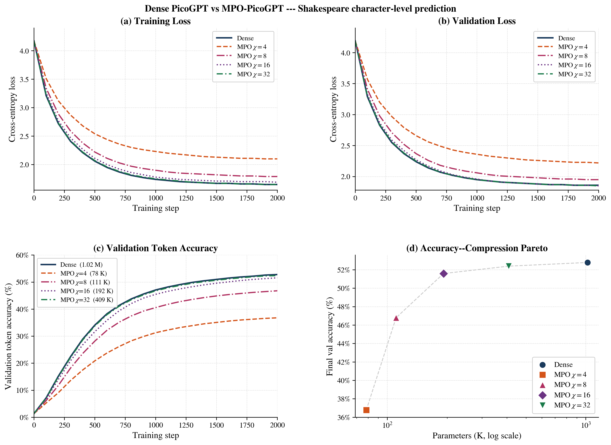

# MPO-PicoGPT

**Compressing Transformer Language Models via Matrix Product Operator Decomposition**

> **Younes Javanmard**¹ · **Tanmoy Pandit**²
>
> ¹ Institut für Theoretische Physik, Leibniz Universität Hannover, Germany
> ² VTT Technical Research Centre of Finland, Espoo, Finland
>
> 📄 [Paper (PDF)](paper/MPO_picoGPT.pdf)

---

This repository contains the full PyTorch implementation for the paper:

> *Compressing Transformer Language Models via Matrix Product Operator Decomposition: A Case Study on PicoGPT*

We apply **Matrix Product Operator (MPO)** decomposition — a tensor network technique from quantum many-body physics — to compress all linear layers of a GPT-2-style transformer. Starting from [PicoGPT.jl](https://github.com/tobiasosborne/PicoGPT.jl), a from-scratch Julia implementation following [Vaswani et al. (2017)](https://arxiv.org/abs/1706.03762), we re-implement the model in PyTorch and replace every `nn.Linear` with an MPO-parameterised equivalent backed by standard `nn.Parameter` tensors — gradient flow is fully automatic, no custom backward pass required.

---

## Results

| Model | Parameters | Compression | Val accuracy |
|:---|---:|---:|---:|
| Dense PicoGPT | 1,020,224 | 1× | 52.8 % |
| MPO χ = 4 | 78,336 | **13.0×** | 36.8 % |
| MPO χ = 8 | 110,592 | **9.2×** | 46.8 % |
| MPO χ = 16 | 191,872 | **5.3×** | 51.6 % |
| MPO χ = 32 | 408,832 | **2.5×** | 52.4 % |

At bond dimension χ = 16, the MPO model retains **97.7 % of the dense accuracy** with only **18.8 % of the parameters**.

### Training curves



---

## Repository structure

```
mpo-picogpt/
├── mpo_picogpt.py        # Core: TT-SVD, MPOLinear, PicoGPT, MPO-PicoGPT
├── benchmark_mpo.py      # Training loop, evaluation, matplotlib benchmark plots
├── generate_plots.py     # Regenerate all publication figures
├── requirements.txt
├── LICENSE               # MIT
├── .gitignore

```

---

## Installation

```bash
git clone https://github.com/y-javanmard/mpo-picogpt.git
cd mpo-picogpt
pip install -r requirements.txt
```

Requires **Python ≥ 3.10** and **PyTorch ≥ 2.0**. No other dependencies.

---

## Quick start

### Build and inspect models

```python
from mpo_picogpt import GPTConfig, PicoGPT, MPO_PicoGPT, compression_report
import torch

cfg = GPTConfig()          # vocab=65, d=128, heads=4, layers=4, seq=256

dense = PicoGPT(cfg)
print(f"Dense params: {dense.n_params():,}")        # 1,020,224

mpo = MPO_PicoGPT(cfg, bond_dim=8)
print(f"MPO params:   {mpo.n_params():,}")          # 110,592

compression_report(dense, bond_dims=[4, 8, 16, 32])
```

### Compress a pretrained dense model

```python
from mpo_picogpt import compress_pretrained

# dense = ...  (already trained PicoGPT)
mpo = compress_pretrained(dense, bond_dim=16)
# Prints per-layer reconstruction errors, returns a fine-tunable MPO model
```

### Forward pass and generation

```python
idx = torch.zeros(1, 1, dtype=torch.long)

logits, loss = mpo(idx)

out = mpo.generate(idx, max_new_tokens=200, temperature=0.8, top_k=40)
```

### Fine-tune MPO cores

```python
optimizer = torch.optim.AdamW(mpo.parameters(), lr=1e-4, weight_decay=0.1)

for x, y in dataloader:
    logits, loss = mpo(x, y)
    optimizer.zero_grad()
    loss.backward()           # gradients flow automatically through tensordot chain
    torch.nn.utils.clip_grad_norm_(mpo.parameters(), 1.0)
    optimizer.step()
```

---

## Benchmark

```bash
# Download Tiny Shakespeare
wget https://raw.githubusercontent.com/karpathy/char-rnn/master/data/tinyshakespeare/input.txt

# Train dense + MPO χ∈{4,8,16,32} from scratch, 2000 steps
python benchmark_mpo.py --steps 2000 --bond-dims 4 8 16 32

# Compress pretrained dense, then fine-tune (500 steps)
python benchmark_mpo.py --steps 500 --bond-dims 8 16 --from-pretrained

# GPU run
python benchmark_mpo.py --device cuda --steps 5000 --bond-dims 4 8 16 32
```

Saves `benchmark_results.png` — a 4-panel figure (train loss / val loss / accuracy / Pareto).

### Regenerate paper figures

```bash
python generate_plots.py
# Writes fig1_*.pdf, fig2_*.pdf, ... into the current directory
```

---

## How MPO compression works

### MPO weight matrix

A weight matrix **W** ∈ ℝ^{out × in} is factorised into a chain of *L* small cores:

```
        d_out[0]   d_out[1]              d_out[L-1]
           |           |                     |
  1 ── A[0] ──χ── A[1] ──χ── … ──χ── A[L-1] ── 1
           |           |                     |
        d_in[0]    d_in[1]               d_in[L-1]

  horizontal lines: virtual (bond) indices of dimension χ
  vertical  lines:  physical indices of small dimension d
```

Contracting all bond indices reconstructs **W** exactly when χ equals the full matrix rank, and approximately for smaller χ.

### TT-SVD algorithm

```python
from mpo_picogpt import mpo_decompose, mpo_to_matrix
import torch

W = torch.randn(512, 128)
cores = mpo_decompose(W,
                      d_out=[8, 8, 8],    # 8×8×8 = 512
                      d_in =[4, 4, 8],    # 4×4×8 = 128
                      max_bond=16)

W_approx = mpo_to_matrix(cores, [8,8,8], [4,4,8])
err = (W - W_approx).norm() / W.norm()
print(f"Relative reconstruction error: {err:.4f}")
```

### Factorisation schemes

| Layer | Shape | L | d_out | d_in | Dense | MPO (χ=8) | Ratio |
|:---|:---|:---:|:---|:---|---:|---:|---:|
| W_Q, W_K, W_V, W_O | 128×128 | 2 | [8,16] | [8,16] | 16,384 | 2,560 | 6.4× |
| W₁ (FFN up) | 512×128 | 3 | [8,8,8] | [4,4,8] | 65,536 | 4,864 | 13.5× |
| W₂ (FFN down) | 128×512 | 3 | [4,4,8] | [8,8,8] | 65,536 | 2,816 | 23.3× |
| W_LM (head) | 65×128 | 2 | [5,13] | [8,16] | 8,320 | 1,984 | 4.2× |

### Parameter count

```
N_MPO  = d_out[0]·d_in[0]·χ
       + (L−2)·χ²·d_out_mid·d_in_mid      ← interior sites
       + χ·d_out[L-1]·d_in[L-1]

N_dense = out × in

Compression ratio ≈ (d_out · d_in)^(L−1) / χ²   [exponential in L]
```

### Connection to DMRG

The gradient with respect to core A[l] during training equals the DMRG single-site gradient:

```
∂L/∂A[l] = (left environment of l)ᵀ  ·  ∂L/∂W  ·  (right environment of l)
```

PyTorch autograd computes this automatically through the `tensordot` contraction chain — no custom backward pass needed.

---

## Module API

| Function / Class | Description |
|:---|:---|
| `mpo_decompose(W, d_out, d_in, max_bond)` | TT-SVD: dense matrix → list of L cores |
| `mpo_to_matrix(cores, d_out, d_in)` | Contract MPO cores → full weight matrix |
| `MPOLinear(d_out, d_in, bond_dim, bias)` | Drop-in replacement for `nn.Linear` |
| `MPOLinear.from_linear(linear, ...)` | Compress a pretrained `nn.Linear` |
| `MPOLinear.get_weight()` | Reconstruct W from cores |
| `MPOLinear.n_params()` | Count MPO parameters |
| `MPOLinear.compression_ratio()` | vs. equivalent dense layer |
| `PicoGPT(cfg, linear_cls)` | Full GPT model; pass `mpo_linear_cls(χ)` for MPO variant |
| `MPO_PicoGPT(cfg, bond_dim)` | Shorthand for MPO-parameterised PicoGPT |
| `compress_pretrained(dense, bond_dim)` | TT-SVD compress all layers, return fine-tunable model |
| `compression_report(dense, bond_dims)` | Print ratio/error table across bond dims |

---

## Background

| ML concept | Quantum physics name |
|:---|:---|
| Tensor Train (TT) format | Matrix Product State (MPS) |
| Operator TT | Matrix Product Operator (MPO) |
| Bond dimension χ | Entanglement cutoff / truncation rank |
| TT-SVD sweep | DMRG truncation sweep |
| Single-site gradient | DMRG/ALS gradient |
| Increasing χ → exact | Area law saturation |

---

## Citation

```bibtex
@article{javanmard2026mpo,
  title   = {Compressing Transformer Language Models via
             Matrix Product Operator Decomposition:
             A Case Study on {PicoGPT}},
  author  = {Javanmard, Younes and Pandit, Tanmoy},
  year    = {2025},
  url     = {https://github.com/younesjavanmard/mpo-picogpt}
}
```

Related works:

```bibtex
@article{oseledets2011tensor,
  title   = {Tensor-train decomposition},
  author  = {Oseledets, Ivan V.},
  journal = {SIAM Journal on Scientific Computing},
  volume  = {33}, number = {5}, pages = {2295--2317}, year = {2011}
}
@inproceedings{novikov2015tensorizing,
  title     = {Tensorizing neural networks},
  author    = {Novikov, Alexander and Podoprikhin, Dmitry and Osokin, Anton and Vetrov, Dmitry},
  booktitle = {NeurIPS}, year = {2015}
}
@inproceedings{vaswani2017attention,
  title     = {Attention is all you need},
  author    = {Vaswani, Ashish and others},
  booktitle = {NeurIPS}, year = {2017},
  url       = {https://arxiv.org/abs/1706.03762}
}
```

---

## Acknowledgements

- [PicoGPT.jl](https://github.com/tobiasosborne/PicoGPT.jl) by Tobias Osborne — reference architecture
- [nanoGPT](https://github.com/karpathy/nanoGPT) by Andrej Karpathy — training philosophy
- [Tiny Shakespeare](https://github.com/karpathy/char-rnn/tree/master/data/tinyshakespeare) dataset by Andrej Karpathy

---

## License

MIT — see [LICENSE](LICENSE).
